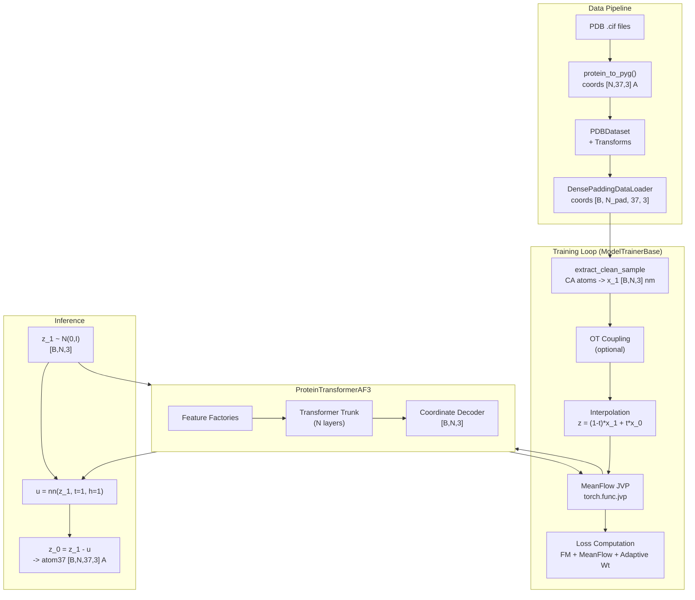
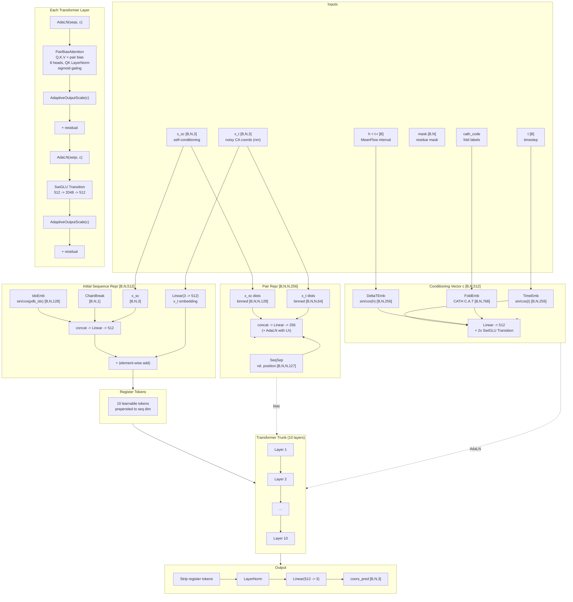
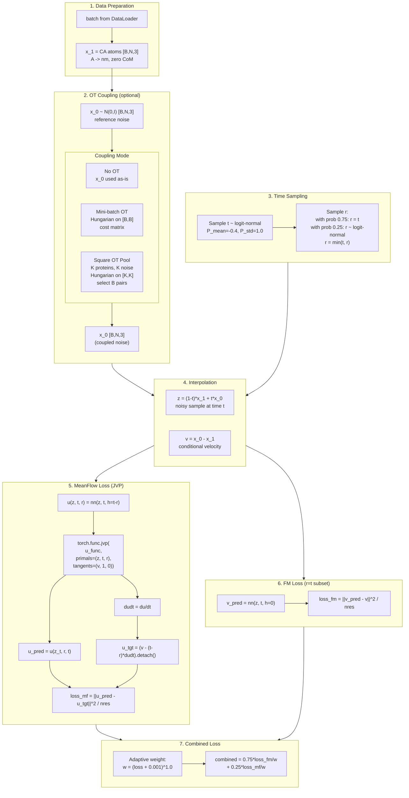
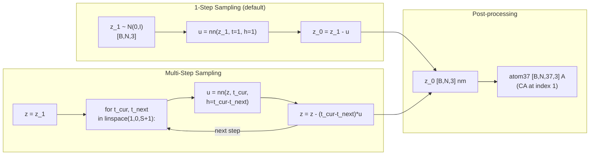

# MeanFlow-OT-Proteina: Architecture & Data Flow

## 1. High-Level System Overview

## 2. ProteinTransformerAF3 — Neural Network Architecture

## 3. Training Step — MeanFlow with OT Coupling

## 4. Inference — MeanFlow Sampling

## 5. Model Variants

| Config | Params | token_dim | layers | heads | pair_dim | Triangle Mult | Pair Update |
|--------|--------|-----------|--------|-------|----------|---------------|-------------|
| `ca_af3_60M_notri` | ~60M | 512 | 10 | 8 | 256 | No | No |
| `ca_af3_200M_no_tri` | ~200M | 768 | 15 | 12 | 512 | No | Every 3 layers |
| `ca_af3_200M_yes_tri` | ~200M | 768 | 15 | 12 | 512 | Yes | Every 3 layers |
| `ca_af3_400M_yes_tri` | ~400M | 1024 | 18 | 16 | 512 | Yes | Every 5 layers |

All variants use 10 register tokens. Note: MeanFlow training requires `update_pair_repr=False` due to JVP incompatibility with `torch.utils.checkpoint`.

## 6. Key Design Decisions

- **Coordinate space**: All internal computation in nanometers; PDB data in Angstroms; conversion at boundaries
- **Center-of-mass**: Zeroed throughout training and inference via `_mask_and_zero_com`
- **Time convention**: t=1 is noise, t=0 is data (opposite of some flow matching papers)
- **MeanFlow**: Network predicts *average velocity* u(z_t, r, t) where h=t-r is passed as conditioning. When r=t (75% of training), collapses to standard flow matching
- **OT coupling**: Hungarian algorithm (deterministic) on masked squared-Euclidean cost; optional square pool samples extra proteins for better coupling quality
- **Adaptive loss weighting**: Per-sample normalization by loss magnitude (Eq. 22) prevents large-loss samples from dominating
- **Self-conditioning**: Previous prediction's coordinates fed back as input features (x_sc); zeros on first pass
- **Fold conditioning**: CATH hierarchy labels with per-level random masking for classifier-free guidance
